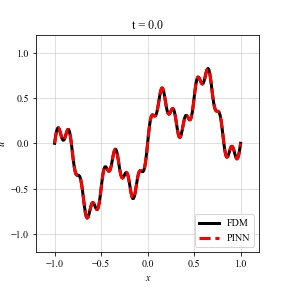

# PINN(s): Physics-Informed Neural Network(s) for diffusion equation

This is an implementation of [PINN(s)](https://doi.org/10.1016/j.jcp.2018.10.045) on TensorFlow 2 to solve 1D linear diffusion equation under Dirichlet boundary condition without training data (data to fit initial & boundary conditions need to be provided). This is enabled by [automatic differentiation](https://arxiv.org/abs/1502.05767), which is a generalization of [back-propagation](https://doi.org/10.1038/323533a0). Within this code, PINN-derived solution is compared with FDM (Finite Difference Method) approximation to show a quantitative agreement. While [original work](https://github.com/maziarraissi/PINNs) is bulit on TensorFlow 1, this repository implements on TensorFlow 2 for GPU-utilized acceleration. 

## Solution
FDM simulation (at t = 0.0, 0.2, 0.4, 0.6, 0.8, 1.0 (s)):

PINN solution (at t = 0.0, 0.2, 0.4, 0.6, 0.8, 1.0 (s)):

With the present setting, the error between FDM and PINN is as follows (scale: 1e-5):
|t|0.0|0.2|0.4|0.6|0.8|1.0|
|:---:|:---:|:---:|:---:|:---:|:---:|:---:|
|Rel. L2 error (scale: 1e-2)|1.358|0.509|0.359|0.272|0.265|2.839|
|MSE           (scale: 1e-7)|9.175|1.290|0.640|0.368|0.348|0.401|
|SEM           (scale: 1e-8)|8.359|1.384|0.525|0.283|0.243|0.762|

## Usage
Simply type
 
<code>
  python main.py
</code>
 
to run code (this includes PINN training, inferece, and visualization). Basic parameters (e.g., network architecture, batch size, initializer, etc.) are found in 
 
<code>
  params.py
</code>
 
and could be modified depending on the problem setup. 

## Dependencies
Tested on 
 
<code>
  python 3.8.10
</code>
 
with the following:

|Package                      |Version|
| :---: | :---: |
|numpy                        |1.22.1|
|scipy                        |1.7.3|
|tensorflow                   |2.8.0|

## Reference
[1] Raissi, M., Perdikaris, P., Karniadakis, G.E.: Physics-informed neural networks: A deep learning framework for solving forward and inverse problems involving nonlinear partial differential equations, *Journal of Computational Physics*, Vol. 378, pp. 686-707, 2019. 
 
[2] Baydin, A.G., Pearlmutter, B.A., Radul, A.A., Siskind, J.M.: Automatic Differentiation in Machine Learning: A Survey, *Journal of Machine Learning Research*, Vol. 18, No. 1, pp. 5595–5637, 2018. 
 
[3] Rumelhart, D., Hinton, G., Williams, R.: Learning representations by back-propagating errors, *Nature*, Vol. 323, pp. 533–536, 1986. 
